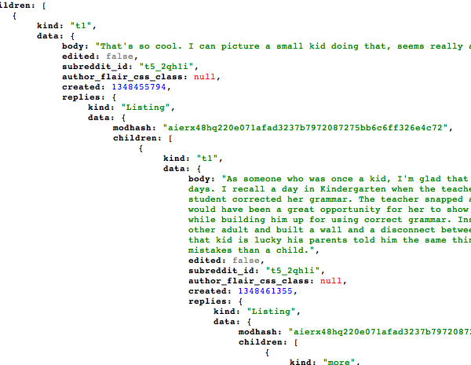

Explore Reddit comments with sigma.js
================================================================

---

Who I am...
===========

**Alexis Jacomy**
-----------------

JavaScript developer @ [Linkfluence](http://linkfluence.net)

 - [jacomyal](http://github.com/jacomyal) on **github**
 - [jacomyal](http://twitter.com/jacomyal) on **twitter**

**Linkfluence**
---------------

 - [linkfluence](http://github.com/linkfluence) on **github**
 - [linklabs](http://twitter.com/linklabs) on **twitter**

---

What is sigma.js ?
=============================================

---

sigma.js is a   JavaScript **graph drawing library**
==================================================================================

---

A *very* brief historic of   **graph drawing tools**
=======================================================

---

**Pajek** (1996):
-----------------

 

*[website](http://vlado.fmf.uni-lj.si/pub/networks/pajek/)*

---

**Gephi** (2008):
-----------------

The "Photoshop" for graphs
--------------------------

*[website](http://gephi.org)*

---

**But what about online tools?**
================================

---

Linkfluence Maps
----------------

 

*from the awesome [Linkfluence Atlas](http://us.linkfluence.net/insights-2-0/atlas/)!*

---

*definitely great, but not open, not generic and in Flash*
======================================================================================

---

**SeaDragon** export from **Gephi**
-----------------------------------

 

*[CPAN explorer, by Linkfluence](http://cpan-explorer.org/)*

---

*but it's not that much interactive*
=================================================================

---

**Protovis.js** and **d3.js**
-----------------------------

 

*[example with d3.js](http://mbostock.github.com/d3/ex/force.html)*

---

*but it's in SVG - not so scalable*
================================================================

---

And here comes sigma.js
--------------------------------------------------

 - written in **JavaScript**
 - dedicated to **graph drawing** - and nothing else
 - **scalable** (Canvas, Frames-injection)
 - open-source
 - **interactivity** oriented

---

Quickly, some use cases:
========================

---

**Facenuke** (by Greenpeace):
---------------------------------------------------------

a network of people - *[link](http://greenpeace.fr/facenuke/)*

---

**French OpenData Viz** (by Data-Publica):
----------------------------------------------------------------------

a network of websites - *[link](http://french-opendata.data-publica.com/)*

---

**NameGenDev** (by Bernie Hogan/Oxford):
--------------------------------------------------------------------

displays your ego-centered Facebook network - *[link](https://apps.facebook.com/namegendev/)*

---

**Movie Galaxies**:
-----------------------------------------------

"the social interaction graph in movies" - *[link](http://moviegalaxies.com/)*

---

Now, let's explore some data!
=============================

---

**Reddit API:**
===============

---

**Load the comments**
---------------------

Here is the URL of a comments page:

        http://www.reddit.com/r/funny/comments/11egv1/snakes_on_a_plane/
                             (subreddit)      (post id)    (title)

With the post ID, we can get comments from Reddit API:

    var postId = '11egv1';

    $.ajax({
      url: 'http://www.reddit.com/comments/'+postId+'.json?jsonp=?',
      type: 'GET',
      dataType: 'jsonp',
      success: function(data){
        getGraph(data);
      }
    });

---

**Get comments:**
-----------------

---

**Get comments ([doc](https://github.com/reddit/reddit/wiki/API)):**
--------------------------------------------------------------------

Comments are sent in a tree, with three types of nodes:

 - `t1` (describes one comment)
 - `Listing` (contains an array of `t1` nodes)
 - `more` (indicates that there are more comments than the API can send)

Every `Listing` node has a `children` that contains an array of `t1` or a `more` node.

If a comment has *replies*, it has a `replies` attribute containing a `Listing` node.

Finally, the root of the tree contains two `Listing` nodes:

 - One with data about the post
 - One with the first level comments

---

**Construct the graph (1):**
----------------------------

    var graph = { nodes: [], edges: [] },
        nodesIndex = {}, edgesIndex = {};

    function getGraph(data) {
      parseNode(data[1], null, graph);

      return graph;
    }

---

**Construct the graph (2):**
----------------------------

    function parseNode(node, parentNodeId) {
      if (node.kind === 'Listing')
        node.data.children.forEach(function(subnode){
          parseNode(subnode, parentNode);
        });
      else if (node.kind === 't1') {
        var nodeId = node.data.author;

        if (!nodesIndex[nodeId]) {
          nodesIndex[nodeId] =  { id: nodeId };
          graph.nodes.push(nodesIndex[nodeId]);
        }

        if (parentNodeId) {
          var edgeId = parentNodeId + '_' + nodeId;

          if (!edgesIndex[edgeId]) {
            edgesIndex[edgeId] = { id: edgeId, source: parentNodeId, target: nodeId };
            graph.edges.push(edgesIndex[edgeId]);
          }
        }

        if (node.data.replies)
          parseNode(node.data.replies, nodeId);
      }
    }

---

**Play with sigma.js:**
==================================================

---

**Instanciate sigma.js:**
----------------------------------------------------

HTML:

    <!-- [...] -->
    

    <!-- [...] -->

JavaScript:

    var sigInst = sigma.init(document.getElementById('sigma-container'));

---

**Customize our instance:**
---------------------------

    sigInst.drawingProperties({
      defaultLabelColor: '#000',
      defaultLabelSize: 14,
      defaultEdgeType: 'curve'
    }).graphProperties({
      minNodeSize: 0.5,
      maxNodeSize: 5
    });

Available customization methods:

 - `configProperties`
 - `drawingProperties`
 - `mouseProperties`
 - `graphProperties`

---

**Fill the graph:**
-----------------------

With `graph` the object we filled earlier:

    var i, n, e,
        N = graph.nodes.length,
        E = graph.edges.length;

    // Add nodes:
    for (i=0; i<N; n = graph.nodes[i++])
      sigInst.addNode(n.id, n);

    // Add edges:
    for (i=0; i<E; e = graph.edges[i++])
      sigInst.addEdge(e.id, e.source, e.target, e);

---

**Navigate in the graph:**
--------------------------

    var p = sigInst.position();
    // Returns an Object:
    // {
    //   stageX: The X position of the stage,
    //   stageY: The Y position of the stage,
    //   ratio:  The zoom ratio of the graph
    // }
    

    sigInst.goTo(
      p.stageX + 10,
      p.stageY + 10
    );
    // Moves the graph by 10 pixels left and
    // 10 pixels top.

---

**Modify the nodes:**
---------------------

The methods `iterNodes` and `iterEdges` make possible to get attributes or modify nodes and edges:

    sigInst.iterNodes(function(node) {
      node.color = '#fc0';
    });

    sigInst.iterEdges(function(edge) {
      edge.color = '#333';
    });

---

**Modify specified nodes:**
---------------------------

You can specify as second argument an array of IDs to iterate only on the specified nodes/edges:

    sigInst.iterNodes(function(node) {
      node.color = '#fc0';
    }, ['node1', 'node2']);

    sigInst.iterEdges(function(edge) {
      edge.color = '#333';
    }, ['edge1']);

---

**Catching mouse hover/down nodes:**
------------------------------------

sigma.js has its own `EventDispatcher` class, with the methods `bind` and `unbind`:

    sigInst.bind('overnodes', function(event) {
      console.log('Over nodes:', event.content.join(', '));
    }).bind('downnodes', function(event) {
      console.log('Down nodes:', event.content.join(', '));
    });

Available events:

 - `downgraph`
 - `upgraph`
 - `downnodes`
 - `upnodes`
 - `graphscaled`
 - `draw`

---

**Demo Time!**
==============

---

**More info:**
--------------

Resources about sigma.js:

 - [sigma.js website](http://sigmajs.org/)
 - [sigmajs](http://twitter.com/sigmajs) on **twitter**
 - [sources](http://github.com/jacomyal/sigma.js) on **github**

Also:

 - Presentation available at: [http://jcml.fr/~jacomyal/osdc2012-presentation](http://jcml.fr/~jacomyal/osdc2012-presentation)
 - Demo available at: [http://jcml.fr/~jacomyal/osdc2012-demo](http://jcml.fr/~jacomyal/osdc2012-demo)