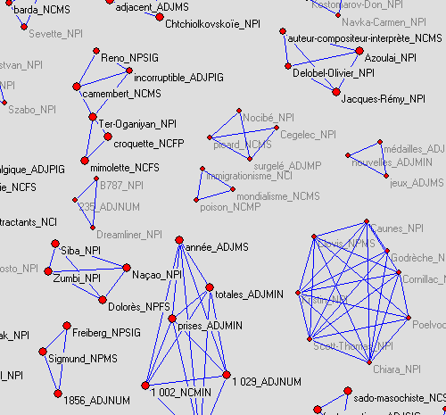
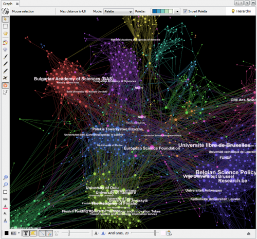
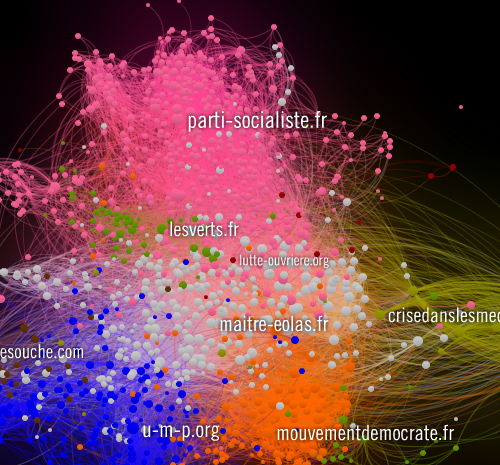
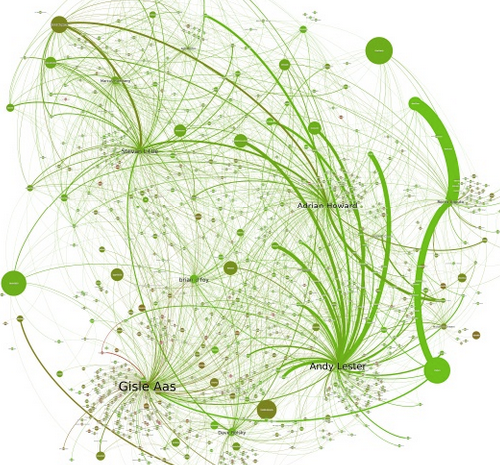
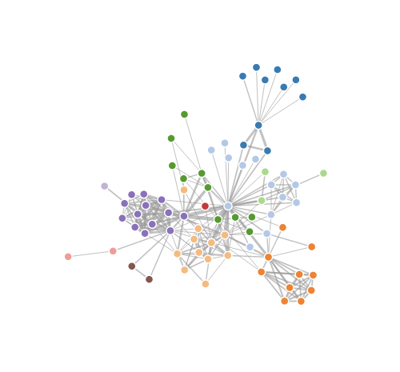
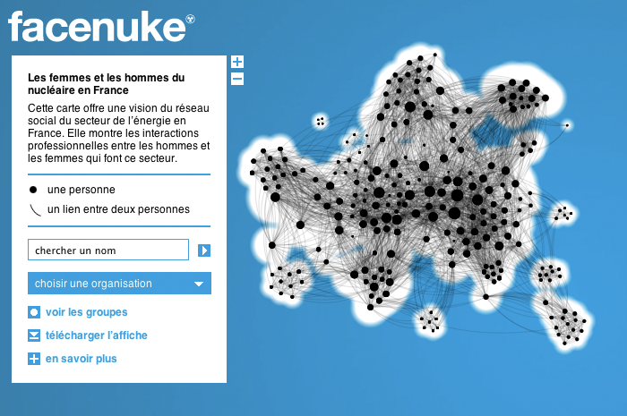
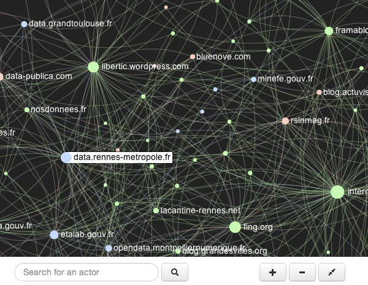
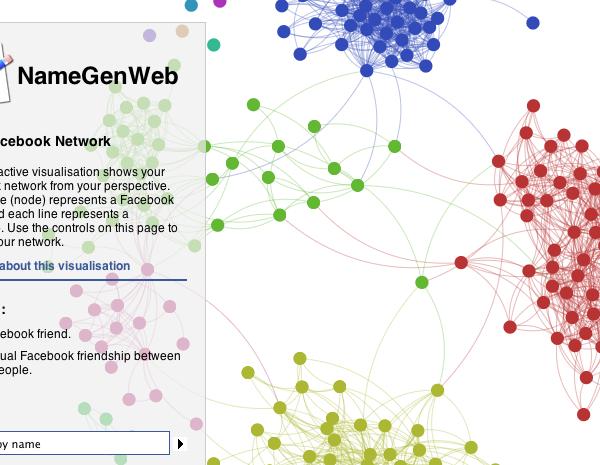
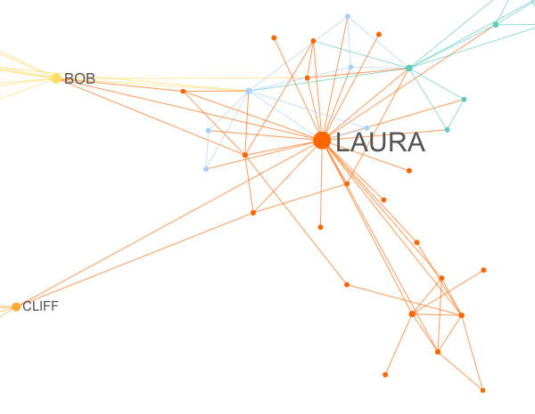

Explore Reddit comments with sigma.js
================================================================

---

Who I am...
===========

**Alexis Jacomy**
-----------------

JavaScript developer @ [Linkfluence](http://linkfluence.net)

 - [jacomyal](http://github.com/jacomyal) on **github**
 - [jacomyal](http://twitter.com/jacomyal) on **twitter**

**Linkfluence**
---------------

 - [linkfluence](http://github.com/linkfluence) on **github**
 - [linklabs](http://twitter.com/linklabs) on **twitter**

---

What is sigma.js ?
=============================================

---

sigma.js is a   JavaScript **graph drawing library**
==================================================================================

---

A *very* brief historic of   **graph drawing tools**
=======================================================

---

**Pajek** (1996):
-----------------

 

*[website](http://vlado.fmf.uni-lj.si/pub/networks/pajek/)*

---

**Gephi** (2008):
-----------------

The "Photoshop" for graphs
--------------------------

*[website](http://gephi.org)*

---

**But what about online tools?**
================================

---

Linkfluence Maps
----------------

 

*from the awesome [Linkfluence Atlas](http://us.linkfluence.net/insights-2-0/atlas/)!*

---

*definitely great, but not open, not generic and in Flash*
======================================================================================

---

**SeaDragon** export from **Gephi**
-----------------------------------

 

*[CPAN explorer, by Linkfluence](http://cpan-explorer.org/)*

---

*but it's not that much interactive*
=================================================================

---

**Protovis.js** and **d3.js**
-----------------------------

 

*[example with d3.js](http://mbostock.github.com/d3/ex/force.html)*

---

*but it's in SVG - not so scalable*
================================================================

---

And here comes sigma.js
--------------------------------------------------

 - written in JavaScript
 - dedicated to **graph drawing** - and nothing else
 - scalable (*until ~2000 nodes ~30000 edges*)
 - fluid (frames are injected during the drawing process)
 - open-source
 - interactivity / user oriented

---

Quickly, some use cases:
========================

---

**Facenuke** (by Greenpeace):
---------------------------------------------------------

a network of people - *[link](http://greenpeace.fr/facenuke/)*

---

**French OpenData Viz** (by Data-Publica):
----------------------------------------------------------------------

a network of websites - *[link](http://french-opendata.data-publica.com/)*

---

**NameGenDev** (by Bernie Hogan/Oxford):
--------------------------------------------------------------------

displays your ego-centered Facebook network - *[link](https://apps.facebook.com/namegendev/)*

---

**Movie Galaxies**:
--------------------------------------------------------------------

"the social interaction graph in movies" - *[link](http://moviegalaxies.com/)*

---

Now, let's explore some data!
=============================

---

**Reddit API:**
===============

---

---

**Play with sigma.js:**
======================================================

---

**Fill the graph (1):**
-----------------------

Assume we have an object `graph` describing our graph:

    var graph = {
      nodes: [
        {
          id: 'node1',
          label: 'Node 1'
        //  [...]
        },
        {
          id: 'node2',
          label: 'Node 2'
        //  [...]
        }
        //[...]
      ],
      edges: [
        {
          source: 'node1',
          target: 'node2',
          id: 'edge1'
        //  [...]
        }
        //[...]
      ]
    };

---

**Fill the graph (2):**
-----------------------

Then, here is the code to show our graph in a sigma.js instance (named `sigInst`):

    var i, n, e,
        N = graph.nodes.length,
        E = graph.edges.length;

    // Add nodes:
    for (i=0; i<N; n = graph.nodes[i++])
      sigInst.addNode(n.id, n);

    // Add edges:
    for (i=0; i<E; e = graph.edges[i++])
      sigInst.addEdge(e.id, e.source, e.target, e);

---

**Navigate in the graph:**
--------------------------

    var p = sigInst.position();
    // Returns an Object:
    // {
    //   stageX: The X position of the stage,
    //   stageY: The Y position of the stage,
    //   ratio:  The zoom ratio of the graph
    // }
    

    sigInst.goTo(
      p.stageX + 10,
      p.stageY + 10
    );
    // Moves the graph by 10 pixels left and
    // 10 pixels top.

---

**Modify the nodes:**
---------------------

    sigInst.iterNodes(function(node) {
      node.color = '#fc0';
    });

---

**Modify specified nodes:**
---------------------------

    // Here is an array containing ids of nodes if the graph:
    var ids = ['node1', 'node2'];

    sigInst.iterNodes(function(node) {
      node.color = '#fc0';
    }, ids);

---

**Catching mouse hover/down nodes:**
------------------------------------

sigma.js has its own `EventDispatcher` class, with the methods `bind` and `unbind`:

    sigInst.bind('overnodes', function(event) {
      console.log('Over nodes:', event.content.join(', '));
    }).bind('downnodes', function(event) {
      console.log('Down nodes:', event.content.join(', '));
    });

Available events:

 - `downgraph`
 - `upgraph`
 - `downnodes`
 - `upnodes`
 - `graphscaled`
 - `draw`

---

**Catching mouse hover nodes:**
-------------------------------
